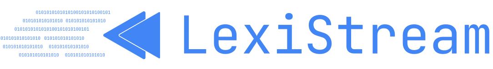

<p align="center">
  <a href="https://lexistreamkit.mesilicon7.com" target="_blank" rel="noopener noreferrer">
     
  </a>
</p>


<h3 align="center">Copy, Paste, Edit & Deploy</h3>
<p align="center">
    <a href="https://lexistreamkit.mesilicon7.com" target="_blank">
        </a>
    <a href="https://twitter.com/intent/follow?screen_name=mesilicon7" target="_blank">
        </a>
    <a href="https://github.com/MeSilicon7/LexiStreamKit/graphs/commit-activity" target="_blank">
        </a>
    <a href="https://github.com/MeSilicon7/LexiStreamKit/" target="_blank">
        </a>
    <a href="https://github.com/MeSilicon7/LexiStreamKit/discussions/" target="_blank">
        </a>
</p>

<!-- <p align="center">
  <a href="./README.md"></a>
  <a href="./README_CN.md"></a>
  <a href="./README_JP.md"></a>
  <a href="./README_ES.md"></a>
  <a href="./README_FR.md"></a>
  <a href="./README_MS.md"></a>
  <a href="./README_TR.md"></a>
  <a href="./README_AR.md"></a>
  <a href="./README_RU.md"></a>
  <a href="./README_KO.md"></a>
  <a href="./README_IT.md"></a>
  <a href="./README_DE.md"></a>
  <a href="./README_PT.md"></a>
  <a href="./README_VI.md"></a>
  <a href="./README_BN.md"></a>
  <a href="./README_ID.md"></a>
  <a href="./README_TH.md"></a>
</p> -->


# LexiStream - A simple code snippet for rendering markdown in real-time built for OpenAi GPT

Hello there! Thank you for stopping by. I’m thrilled to share this project with you and I’m eager to make it better with your help. Whether you’re here to use the project, report a bug, or contribute, your input is highly appreciated.

This guide introduces LexiStream, a library designed to streamline the creation of a chatbot interface that interacts seamlessly with OpenAI's GPT API. Ideal for developers looking to integrate advanced conversational capabilities without being tied to a specific backend architecture.

## Features

- Real-time streaming of chat responses.
- Customizable UI components.
- Easy integration with any web application.
- No complex build tools required.

https://github.com/MeSilicon7/LexiStreamKit/blob/main/assets/Github-intro.mp4

## Table of contents

- [Installation & Usage](#installation--usage)
- [Configuration Options](#configuration-options)
- [Methods](#methods)
- [Styling](#styling)
- [Language Syntax Highlighting](#language-syntax-highlighting)
- [Future Roadmap](#future-roadmap)
- [License](#license)


## Installation & Usage

Include the LexiStream.js script in your project:

> [!NOTE]
> Short Tutorial [LexiStream Kit Tutorial](https://lexistreamkit.mesilicon7.com).Here example projects [LexiStream Example](https://lexistreamkit.mesilicon7.com) 

> [!IMPORTANT]
> Your backend needs to support Server-Sent Events (SSE) to stream data to the client effectively. **Replace every newline character ('\n') with ' \<br\> ' since '\n' does not behave as expected in SSE; it seems to disappear.** Additionally, you should conclude your streaming with 'data: finish_reason: stop\n\n' to ensure the client side recognizes that the stream has ended. Without this specific message, LexiStream will continue to wait for more data and won't close the stream.


```html
<script type='module' src="path/to/LexiMark.js"></script>
<script src="path/to/LexiStream.js"></script>
```

Setup your HTML:

```html
<div id="chat-box">
    <input type="text" id="input-box" placeholder="Type your message here...">
    <button id="start-button">Start</button>
    <button id="stop-button" disabled>Stop</button>
</div>
```

Initialize LexiStream in your JavaScript file:

```javascript
document.addEventListener('DOMContentLoaded', function() {
    const config = {
        box: '#chat-box',
        sendContent: '#input-box',
        start: '#start-button',
        stop: '#stop-button',
        sendRequest: '/send',
        listen: '/stream'
    };

    const chatInterface = new LexiStream(config);
});
```


## Configuration Options

- `box`: Selector for the chat box container.
- `sendContent`: Selector for the input box.
- `start`: Selector for the start button.
- `stop`: Selector for the stop button.
- `sendRequest`: URL for sending messages.
- `listen`: URL for receiving streamed messages.

## Methods

- `startStream()`: Starts the message stream.
- `stopStream()`: Stops the message stream.
- `sendMessage(message)`: Sends a message to the server.


## Styling

You can use custom tag or class names to style the chat interface. The default tags are `div` for user messages and `lexi-mark` for server messages. You can customize these tags in the LexiStream configuration object.

```javascript
const config = {
  customInputTag: 'input',
  customOutputTag: 'output',
  customErrorTag: 'error',
  customLoadingTag: 'loading'
};

const chatInterface = new LexiStream(config);
```

See advanced usage for more customization options. [Link](#advance)

## Language Syntax Highlighting

LexiStream uses the LexiMark library for rendering markdown text and syntax highlighting. You can customize the syntax highlighting theme by including the desired PrismJS theme in your project. The default theme is `prism-twilight.css`. Read LexiMark documentation for more details. 
[LexiMark](docs/LexiMark/README-LexiMark.md)

## Future Roadmap ::

- [ ] Task 1: Make a full example with a backend.
- [ ] Task 2: Add a bar for the user to select the model, TTS, and STT etc.

## Advance

LexiStream is highly customizable and can be configured to fit your specific needs. [LexiStream](docs/LexiStream/README.md)


**Contributors**

<a href="https://github.com/MeSilicon7/LexiStreamKit/graphs/contributors">
  
</a>

## Community & contact

* [Github Discussion](https://github.com/MeSilicon7/LexiStreamKit/discussions). Best for: sharing feedback and asking questions.
* [GitHub Issues](https://github.com/MeSilicon7/LexiStreamKit/issues).
* [Twitter](https://twitter.com/mesilicon7).


<!-- ## Star history

[](https://star-history.com/#MeSilicon7/LexiStreamKit&Date) -->


## License

No license restrictions, but attribution is appreciated.
